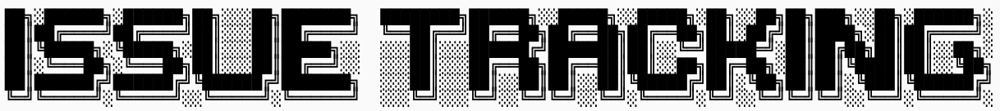

## QUICK start
1. `git clone` the project
2. `cd ./Application`
3. `make clean`
4. `make`
5. Populate a sample database `./test_system`
6. Run the program demo `./test_ui`

## Installing SQLite
install sqlite3 using the following command.
```shell
sudo apt update 
sudo apt upgrade
sudo apt-get install libsqlite3-dev
sqlite3 --version
```
If you can see the version, installation is OK.

# Modules
- Database module = {Database.h, Database.cpp}
- Project module = {Project.h, Project.cpp}
- Release module = {Release.h, Release.cpp}
- Requester module = {Requester,h, Requester.cpp}
- ChangeItem module = {ChangeItem.h, ChangeItem.cpp}
- ChangeRequest module = {ChangeRequest.h, ChangeRequest.cpp}
- UserInterface module = {UserInterface.h, UserInterface.cpp}
- Main module = {main.cpp}

<br>Each module has the following files:
1. a `*.h` header file,
2. a `*.cpp` file,
3. and a `test_*cpp`. <br>
standard g++ compilation.<br>
e.g., `g++ -o test_UserInterface UserInterface.cpp  main.cpp -lsqlite3`<br>
The file names are self-explanatory
`cd ./Application` <br>

Our application is consists of the following modules: <br>
1. Database Module: Manage the connection to SQLite database, execute SQL queries, handles database related shit. e.g., The Project module can call executeSQL() to create, update a project.
2. Project Module: Manage project-related operations e.g., create, update, ...
3. ChangeItem Module: Manage change item related shit.
4. Release module
5. Requester Module
6. ChangeRequest Module
7. UI module handles menu navigation
8. Main module: entry point of the program, inititalize modules and running the main loop.

Each module consists of a .h and a .cpp file and a test_*.cpp <br>

Essentially, moduels 2 to 6 parse the user inputs into sql query statements/code and ask module 1 to call the sqlite library and run the code.<br>

# TODO
### Menu Module
1. compile the UserInterface unit test `g++ -o test_UserInterface UserInterface.cpp  main.cpp -lsqlite3`
2. Complete the UserInterface module by implementing constraint-checking functions, i.e. check user input before getline(), e.g., projectId is 12 digits long, Descriptions are 30 char long, make sure the user input follow these constraints. refere to the requirement spec for these constraints. If invalid input prompt the user to re-enter.
3. Test the menu, make it robust.
4. You don't need to read/write to database yet, but make sure menu nagivation works according to our user manual.


The Project, Release, Requester, ChagneRequest, ChangeItem modules are responsible for parsing user input into SQL statement in the form of C-style strings<br>

The function then calls `executeSQL` function from the Database class. The `executeSQL` function turns the C-styled string SQL statement into SQL execution command, to be compiled at compile time. <br>

In every other modules, the Database module is included i.e., ```c #include "Database.h ``` This is because the other modules simply takes raw user inputs and turn them into SQL statements in the format of C-style strings. For example:<br>

 * Example flow
 * 
 * When a user selects an option to create new project:
 *  1. The UserInterface module calls Porject::addProject() with the provided prject details
 *  2. Project::addProject() constructs the SQL statement `INSERT` statement and calls
 *     Database::executeSQL() to insert the new project record into the database.
 * 
 * When a user selects an option to generate a report:
 *  1. The UserInterface module calls Project::getProjects() constucts the SQL `SELECT` statement and calls
 *     Database::querySQL() to retrieve the project records from the database.